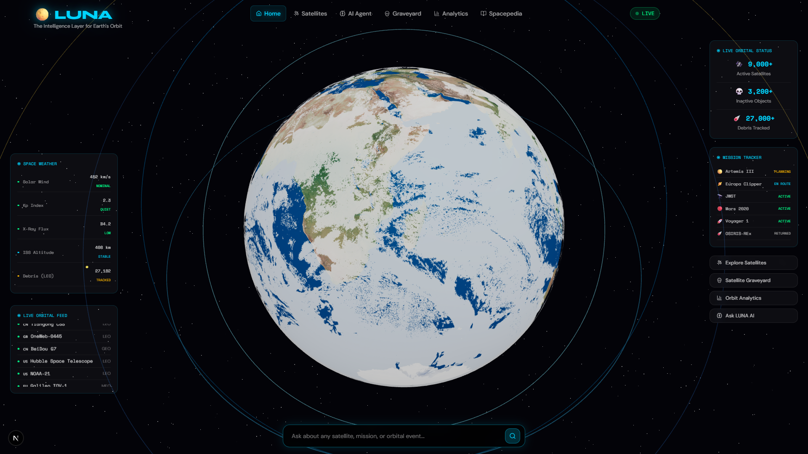
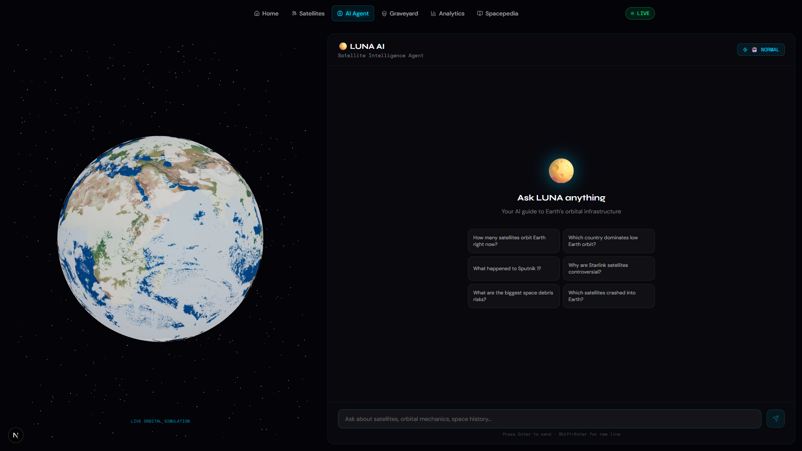
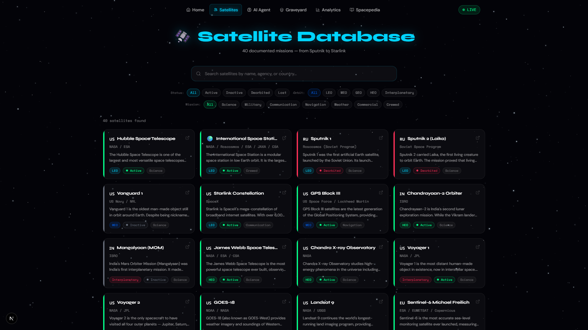
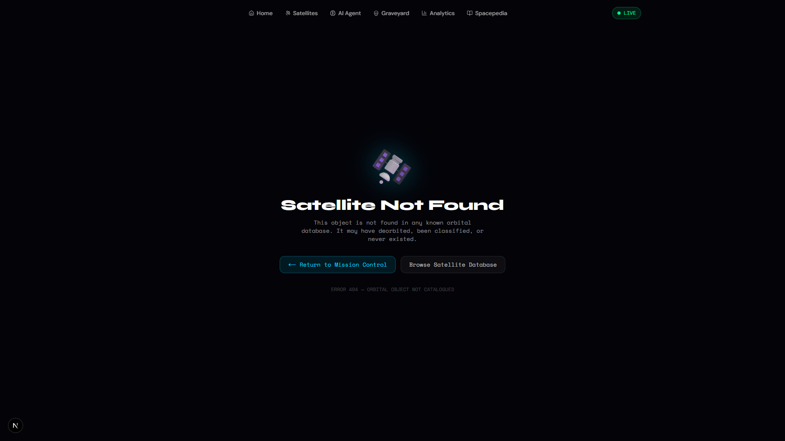
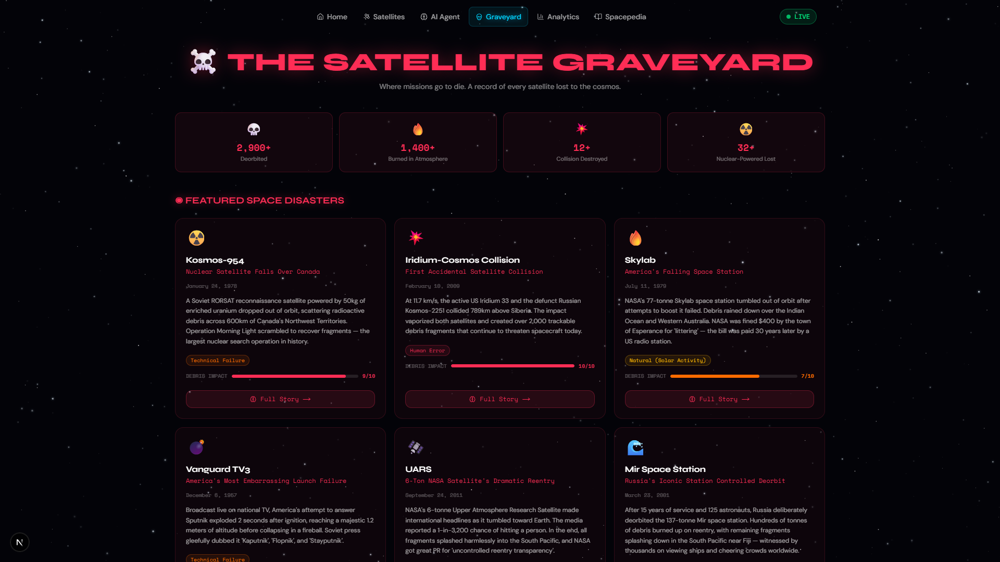
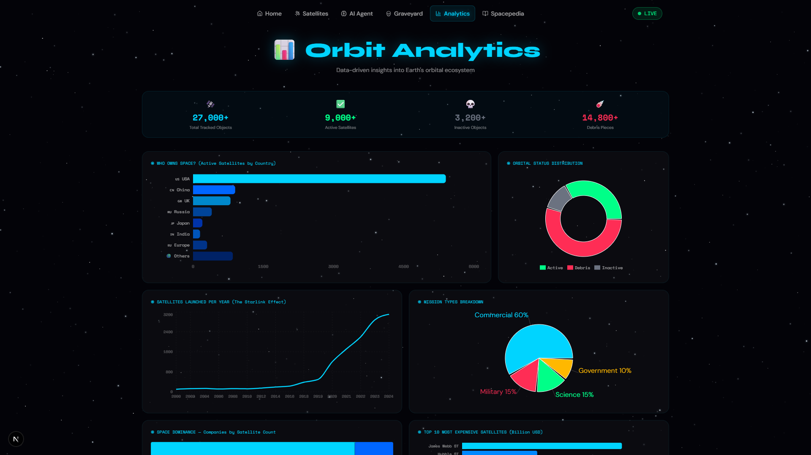
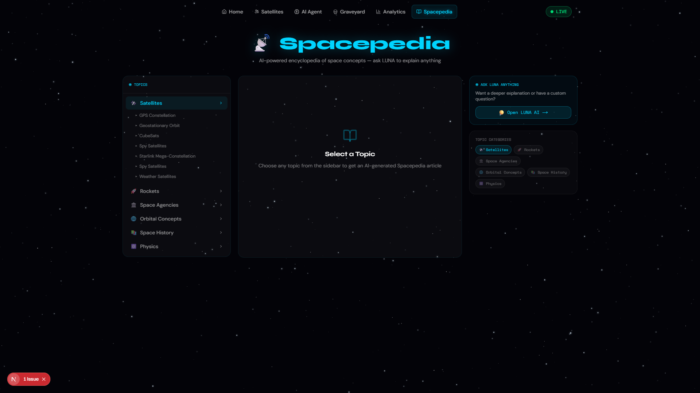

<div align="center">

# 🌕 LUNA — Satellite Intelligence Platform

**The Intelligence Layer for Earth's Orbit**

[](https://nextjs.org/)
[](https://www.typescriptlang.org/)
[](https://threejs.org/)
[](https://www.anthropic.com/)
[](https://tailwindcss.com/)

LUNA is a full-stack, NASA-style satellite intelligence platform that combines a real-time interactive 3D Earth globe, AI-powered natural-language querying via Claude, a comprehensive satellite database, orbital analytics, and an AI-generated space encyclopedia — all wrapped in a dark glassmorphism mission-control UI.

[Live Demo](#) · [Report Bug](https://github.com/SaranAdhith/PROJECT-LUNA-/issues) · [Request Feature](https://github.com/SaranAdhith/PROJECT-LUNA-/issues)

</div>

---

## Table of Contents

- [Screenshots](#screenshots)
- [Features](#features)
- [Tech Stack](#tech-stack)
- [Getting Started](#getting-started)
- [Project Structure](#project-structure)
- [Pages & Routes](#pages--routes)
- [Environment Variables](#environment-variables)
- [License](#license)

---

## Screenshots

### 🌍 Homepage — Interactive Earth Globe
> Full-screen Three.js Earth with live orbital feed, space weather panel, mission tracker, and the Ask LUNA search bar.



---

### 🤖 AI Agent — Ask LUNA
> Split-screen Claude-powered chat interface with a mini Earth globe. Supports Normal mode and Alien mode for different AI personas. Queries can be pre-filled via the `?q=` URL parameter from the homepage.



---

### 🛰️ Satellites Explorer
> Searchable and filterable grid of 40+ real-world satellites. Filter by orbit type (LEO / MEO / GEO / HEO), country, or status. Each card links to a full detail page.



---

### 🛰️ Satellite Detail Page
> Individual satellite pages with mission overview, orbital parameters, launch history, and a direct "Ask LUNA" button to query the AI agent about that specific satellite.



---

### 💀 Satellite Graveyard
> Red-accented disaster memorial page featuring 6 major space disaster stories plus a full registry table of defunct satellites and mission failures.



---

### 📊 Orbit Analytics Dashboard
> Recharts-powered mission control dashboard with:
> - Bar chart — satellites by country
> - Donut/pie chart — active vs inactive vs debris
> - Line chart — annual launch trends (2000–2024)
> - Treemap — satellite distribution by operator



---

### 📚 Spacepedia — AI Encyclopedia
> Topic-based space encyclopedia where each entry is generated live by the LUNA AI. Streams responses in real time for topics like Black Holes, Dark Matter, ISS, Exoplanets, and more.



---

## Features

| Feature | Description |
|---|---|
| 🌍 **3D Earth Globe** | Interactive WebGL Earth rendered with Three.js and @react-three/fiber, with animated orbit rings and clickable satellite markers |
| 🤖 **LUNA AI Chat** | Streaming Claude (claude-sonnet) integration with two personality modes — Normal and Alien — powered by the Anthropic SDK |
| 🛰️ **Satellite Database** | 40+ satellite records with full detail pages, search, and multi-dimensional filtering |
| 📊 **Analytics Dashboard** | Real-time charts (bar, pie/donut, line, treemap) built with Recharts |
| 💀 **Graveyard** | Space disaster registry with curated stories and a full defunct-satellite table |
| 📚 **Spacepedia** | AI-generated streaming encyclopedia for any space topic |
| ⭐ **Starfield Background** | Canvas-animated starfield across all pages |
| 🧊 **Glassmorphism UI** | Frosted-glass panels, scroll-reactive navbar, and a deep-space dark theme |
| 🚀 **Static Generation** | All satellite detail pages are statically generated at build time via `generateStaticParams` |
| 📱 **Responsive** | Fully responsive layout across desktop, tablet, and mobile |

---

## Tech Stack

### Frontend
| Library | Version | Purpose |
|---|---|---|
| [Next.js](https://nextjs.org/) | 16 | React framework with App Router, SSR/SSG |
| [React](https://react.dev/) | 19 | UI library |
| [TypeScript](https://www.typescriptlang.org/) | 5 | Type safety |
| [Tailwind CSS](https://tailwindcss.com/) | v4 | Utility-first styling |
| [Framer Motion](https://www.framer.com/motion/) | 12 | Animations and transitions |

### 3D & Visualization
| Library | Version | Purpose |
|---|---|---|
| [Three.js](https://threejs.org/) | r169 | WebGL 3D rendering |
| [@react-three/fiber](https://docs.pmnd.rs/react-three-fiber) | 9 | React renderer for Three.js |
| [@react-three/drei](https://github.com/pmndrs/drei) | latest | Three.js helpers |
| [Recharts](https://recharts.org/) | 3 | React chart components |

### AI & Data
| Library | Version | Purpose |
|---|---|---|
| [@anthropic-ai/sdk](https://www.npmjs.com/package/@anthropic-ai/sdk) | latest | Claude AI streaming API |
| [Lucide React](https://lucide.dev/) | latest | Icon library |

---

## Getting Started

### Prerequisites

- Node.js 20+
- An [Anthropic API key](https://console.anthropic.com/)

### Installation

```bash
# 1. Clone the repository
git clone https://github.com/SaranAdhith/PROJECT-LUNA-.git
cd PROJECT-LUNA-

# 2. Install dependencies
npm install

# 3. Set up environment variables
cp .env.example .env.local
# Then edit .env.local and add your Anthropic API key
```

### Environment Variables

Create a `.env.local` file in the root of the project:

```env
ANTHROPIC_API_KEY=sk-ant-your-key-here
```

> Get your API key from [console.anthropic.com](https://console.anthropic.com/)

### Running Locally

```bash
npm run dev
```

Open [http://localhost:3000](http://localhost:3000) in your browser.

### Building for Production

```bash
npm run build
npm start
```

The build generates 50+ static pages with zero TypeScript errors.

---

## Project Structure

```
luna/
├── app/
│   ├── page.tsx                  # Homepage — 3D Earth globe
│   ├── layout.tsx                # Root layout with fonts & navbar
│   ├── globals.css               # Design tokens & global styles
│   ├── not-found.tsx             # 404 page
│   ├── ai-agent/
│   │   └── page.tsx              # AI chat interface
│   ├── satellites/
│   │   ├── page.tsx              # Satellite explorer/search grid
│   │   └── [id]/
│   │       └── page.tsx          # Individual satellite detail
│   ├── graveyard/
│   │   └── page.tsx              # Space disaster registry
│   ├── analytics/
│   │   └── page.tsx              # Recharts analytics dashboard
│   ├── spacepedia/
│   │   └── page.tsx              # AI-generated space encyclopedia
│   └── api/
│       └── chat/
│           └── route.ts          # Streaming Claude API route
├── components/
│   ├── earth/
│   │   └── EarthGlobe.tsx        # Three.js WebGL Earth component
│   ├── ui/
│   │   ├── Navbar.tsx            # Scroll-reactive glassmorphism navbar
│   │   └── StarField.tsx         # Animated canvas starfield
│   └── ai/
│       └── ChatInterface.tsx     # Streaming chat with mode toggle
├── lib/
│   ├── satellite-data.ts         # 40+ satellite records & helpers
│   └── anthropic.ts              # LUNA_SYSTEM_PROMPT & ALIEN_SYSTEM_PROMPT
├── public/
│   └── textures/                 # Earth texture maps for Three.js
└── screenshots/                  # README screenshots (add your own)
```

---

## Pages & Routes

| Route | Page | Description |
|---|---|---|
| `/` | Homepage | Full-screen 3D Earth with live panels and Ask LUNA bar |
| `/ai-agent` | AI Agent | Claude-powered satellite chat (`?q=` for pre-filled query) |
| `/satellites` | Explorer | Searchable, filterable satellite grid |
| `/satellites/[id]` | Detail | Static detail page per satellite |
| `/graveyard` | Graveyard | Space disaster registry with red theme |
| `/analytics` | Analytics | Charts dashboard — bar, pie, line, treemap |
| `/spacepedia` | Spacepedia | AI-generated streaming space encyclopedia |

---

## Design System

| Token | Value | Usage |
|---|---|---|
| Background void | `#030308` | Page backgrounds |
| Accent cyan | `#00D4FF` | Primary UI accent, borders, labels |
| Danger red | `#FF2D55` | Graveyard theme, error states |
| Success green | `#00FF88` | Active status indicators |
| Amber | `#FFB800` | Warning / planning states |
| Font — Display | Syne | Headings and brand text |
| Font — Mono | Space Mono | Labels, data readouts, terminal text |
| Font — Body | DM Sans | UI copy and paragraphs |

---

## Adding Screenshots

To add screenshots to this README:

1. Run `npm run dev` to start the local server
2. Visit each route in your browser
3. Take a screenshot of each page and save it as:

```
screenshots/
  01-homepage.png
  02-ai-agent.png
  03-satellites.png
  04-satellite-detail.png
  05-graveyard.png
  06-analytics.png
  07-spacepedia.png
```

4. Commit the screenshots and push:
```bash
git add screenshots/
git commit -m "Add screenshots"
git push
```

---

## License

This project is open source and available under the [MIT License](LICENSE).

---

<div align="center">

Built with passion for space exploration

**[⬆ Back to Top](#-luna--satellite-intelligence-platform)**

</div>
